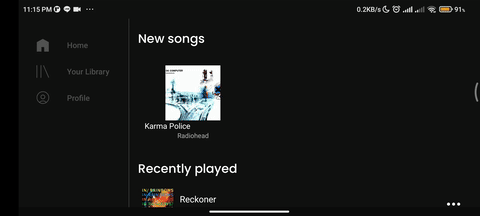
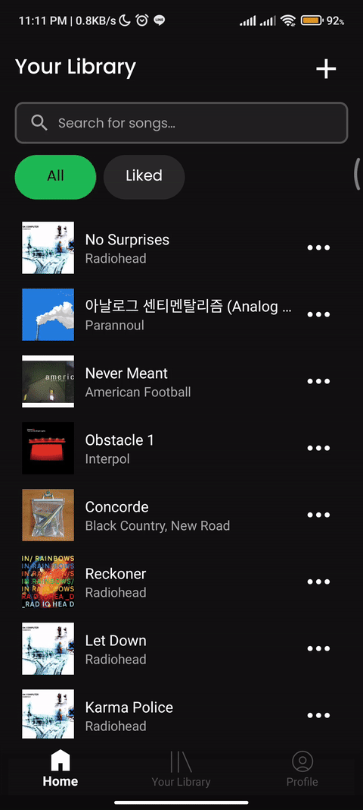
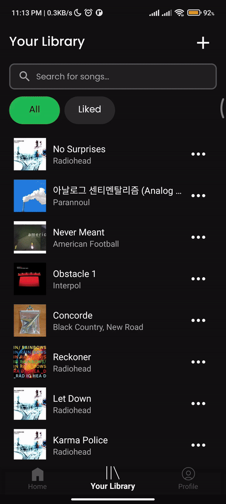

# App Description
<p align="center">
    
</p>
<p align="center">
    
</p>
<hr>
<br>

*Purrytify* is a Spotify-inspired music player app for Android that lets users upload and play songs stored in their local device. The features available in this app include:

* On-background music player to play song files stored in local device
* Pause song, play previous/next song, queue, loop, and shuffle songs
* Uploading songs from local device (complete with automatic metadata retrieval)
* Tracking of user's recently added and recently played songs
* Tracking of user's liked songs
* Editing and deleting songs
* Login/logout and personalized data for each user
* Responsive layout for portrait and landscape

This project was made using Kotlin, Gradle, and Android Studio and was developed as an assignment for the course IF3210 Mobile App Development in Bandung Institute of Technology's Informatics Engineering Department.

# How to Run
To run this project locally, follow these steps:

1. **Clone the repository**

   ```bash
   git clone https://github.com/Labpro-21/if3210-tubes-mad-2025-if3210-2025-mad-bsm.git
   ```

2. **Open the project in Android Studio**  
   Launch Android Studio and choose `Open an existing project`, then select the cloned directory.

3. **Build the project**  
   In the top-right corner of Android Studio, click the "Build" button (represented by a hammer icon). Wait until the Build Analyzer shows a "Successful" message.

4. **Run the application**  
   Click the green triangle-shaped "Run" button at the top of Android Studio to launch the app on your selected device or emulator.

# Used Libraries
| Library | Description |
|--------|-------------|
| **[Hilt (Dagger)](https://dagger.dev/hilt/)**  
`com.google.dagger:hilt-android`, `androidx.hilt:*` | Dependency injection library built on top of Dagger with Android Jetpack integration. |
| **[Glide](https://github.com/bumptech/glide)**  
`com.github.bumptech.glide:glide` | Image loading and caching library for Android. |
| **[Retrofit](https://square.github.io/retrofit/)**  
`com.squareup.retrofit2:*` | Type-safe HTTP client for Android and Java. |
| **[OkHttp Logging Interceptor](https://square.github.io/okhttp/)**  
`com.squareup.okhttp3:logging-interceptor` | Logs HTTP request and response data for debugging. |
| **[Room](https://developer.android.com/jetpack/androidx/releases/room)**  
`androidx.room:*` | SQLite abstraction library for robust local data persistence. |
| **[Material Components](https://m3.material.io/)**  
`com.google.android.material:material` | Modern UI components based on Material Design. |
| **[Android Identity Credential](https://developer.android.com/guide/topics/identity/identity-credential)**  
`com.android.identity:identity-jvm` | Secure storage and transmission of digital identity credentials. |

# App Preview

## Login
<p align="center">
    
</p>
<hr>

<p align="center">
    
</p>
<hr>

<p align="center">
    
</p>
<hr>

<p align="center">
    
</p>

<p align="center">
    
</p>

## Home 
<p align="center">
    
</p> 
<hr>

<p align="center">
    
</p> 

## Library
<p align="center">
    
</p> 
<hr>


<p align="center">
    
</p> 

## Search
<p align="center">
    
</p> 
<hr>


## Currently Playing Song
<p align="center">
    
</p> 
<hr>
<p align="center">
    
</p>

## Miniplayer
<p align="center">
    
</p> 

## Upload Songs
<p align="center">
    
</p> 
<hr>

<p align="center">
    
</p> 
<hr>

<p align="center">
    
</p> 

## Song Actions
<p align="center">
    
</p> 

## Landscape Preview

# Developers
| NIM / Student ID | Name | Task |
|------------------|------|------------------|
| 13522134 | Shabrina Maharani | Implement home page with recyclerview, landscape layout for all page, add eye patch in password, add function for liked songs |
| 13522157 | Muhammad Davis Adhipramana | Implement SongTrackView, MiniPlayer, Integrasi Flow dari song data, Play Song, Love Song, Repeat, Shuffle, Queue |
| 13522158 | Muhammad Rasheed Qais Tandjung | Implement library page with recyclerview, create upload songs page and mechanism, initialize room database, search songs feature |
| 13522164 | Valentino Chryslie Triadi | Bottom Navbar, Login Page, API Fetch, Token/Session Manager, Network Sensing, Profile, Background Process, Personalized Songs |

| NIM / Student ID | Name | Planning Hours | Development Hours |
|------------------|------|------|---------------------|
| 13522134 | Shabrina Maharani | 3 | 38
| 13522157 | Muhammad Davis Adhipramana | 4 | 52
| 13522158 | Muhammad Rasheed Qais Tandjung | 5 | 38
| 13522164 | Valentino Chryslie Triadi | - | 72
