# App Description

    

 

*Purrytify* is a Spotify-inspired music player Android app that lets users upload and play songs stored in their local device. The features available in this app include:

* On-background music player to play song files stored in local device
* Pause song, play previous/next song, queue, loop, and shuffle songs
* Uploading songs from local device (complete with automatic metadata retrieval)
* Tracking of user's recently added and recently played songs
* Tracking of user's liked songs
* Editing and deleting songs
* Login/logout and personalized data for each user
* Responsive layout for portrait and landscape

# How to Run

# Used Libraries

# App Preview

## Login

    

    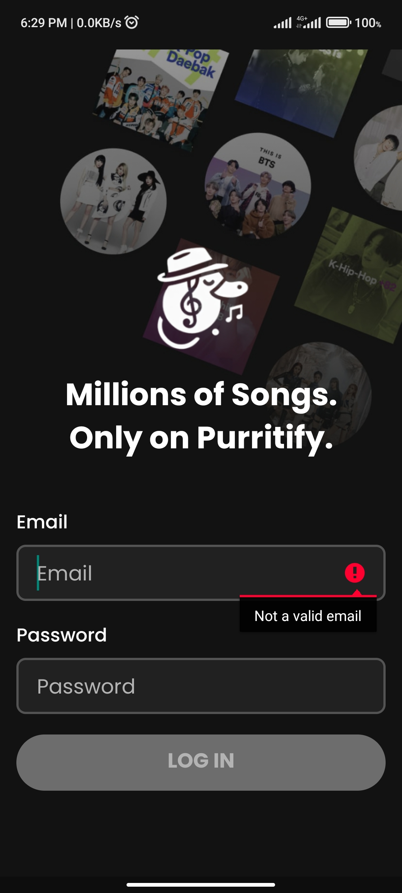

    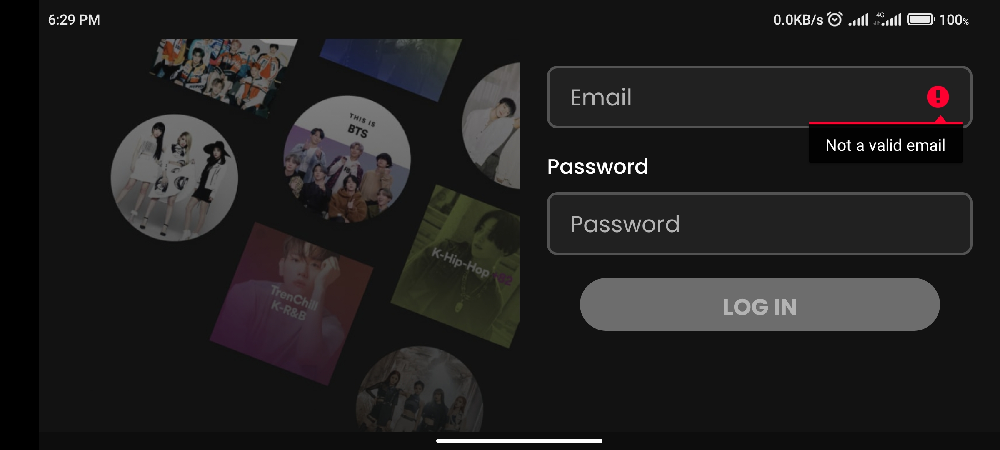

    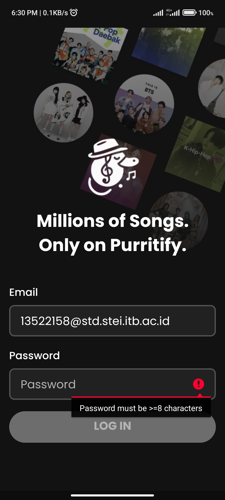

## Home 

    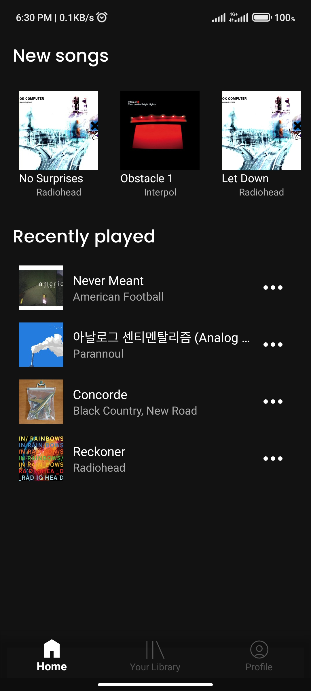

 

    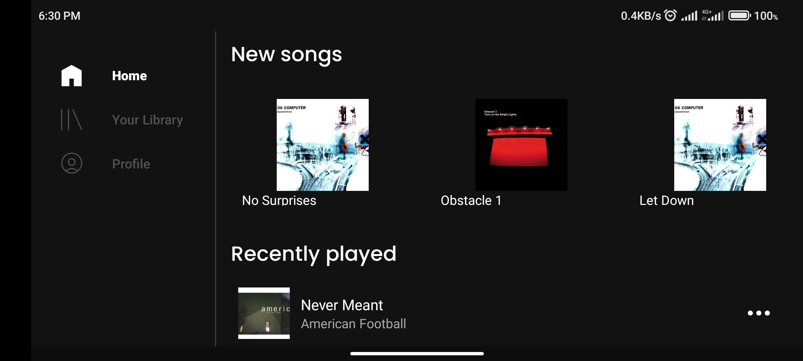

 

## Library

    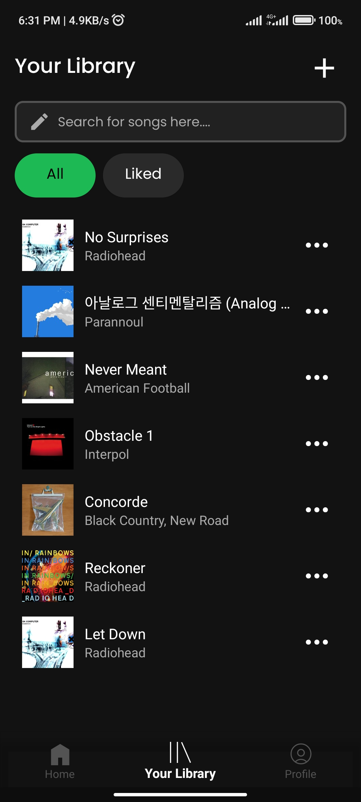

 

    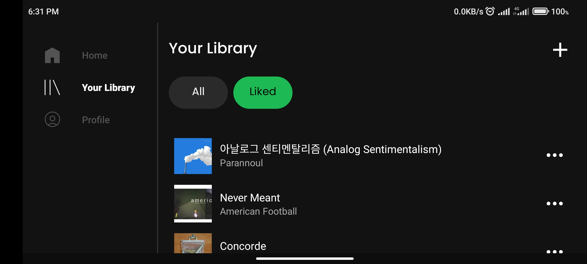

 

## Profile

## Currently Playing Song

    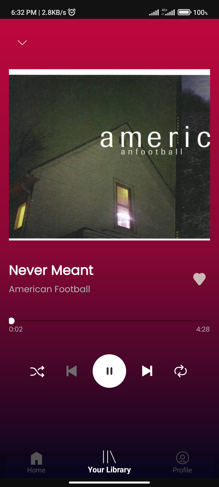

 

## Miniplayer

    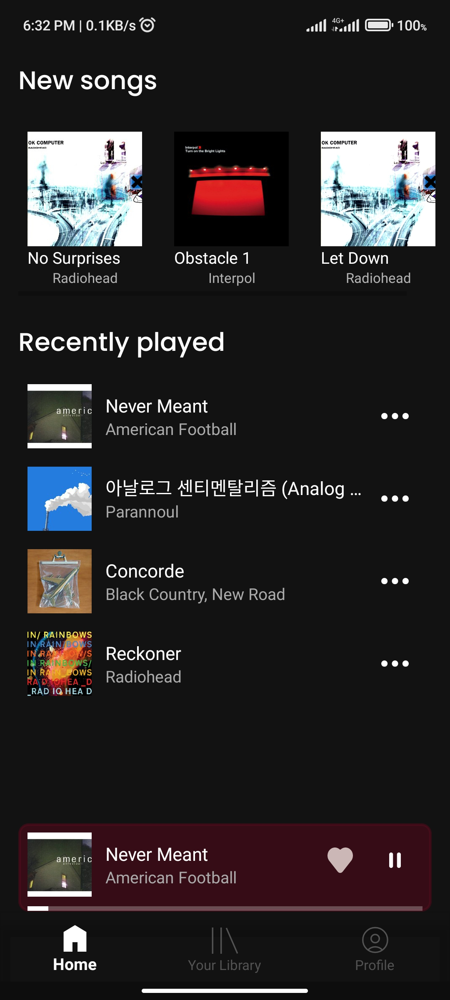

 

## Upload Songs

    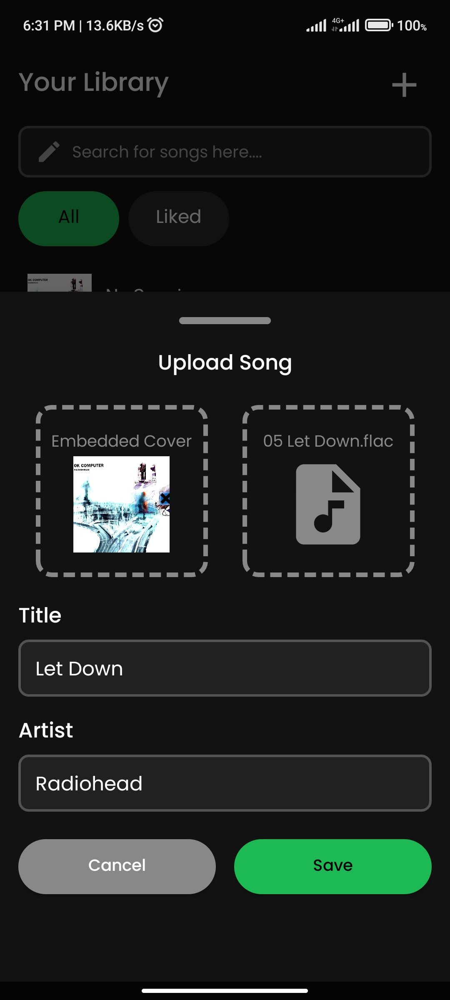

 

    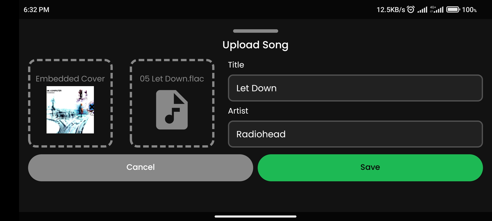

 

## Song Actions

    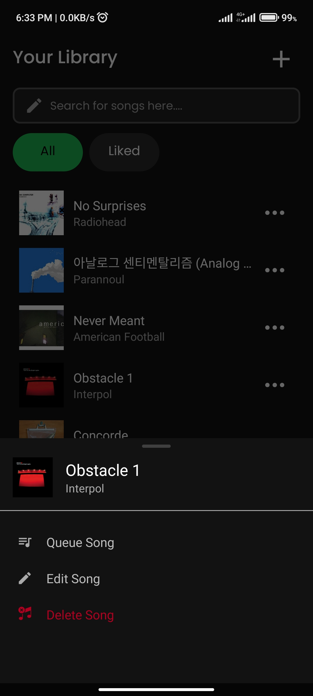

 

# Developers
| NIM / Student ID | Name | Development Role | Planning Hours | Development Hours |
|------------------|------|------------------|----------------|-------------------|
| 13522144 | Shabrina Maharani | test | 20 | 20
| 13522157 | Muhammad Davis Adhipramana | test | 20 | 20
| 13522158 | Muhammad Rasheed Qais Tandjung | test | 20 | 20
| 13522164 | Valentino Chryslie Triadi | test | 20 | 20